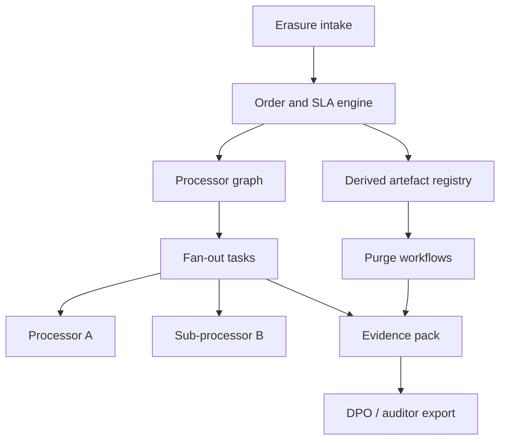

# Erasuremesh

**Source:** `ai-in-decentralized+ai/Accenture-GDPR-PoV/`
**Domain:** `ai-decentralized`
**One-liner:** An erasure orchestration mesh that fans a single “right to be forgotten” order across controller, processors, and sub-processors — including ML-derived personas — and returns a dual-readable evidence pack before the SLA clock expires.
**Wedge:** Multi-tenant SaaS and cloud vendors whose customers process EU personal data through nested processor chains (ERP → IaaS → payment plug-in), starting with erasure plus derived-artefact purge rather than full privacy-program suites.
**Positioning:** Supply-chain erasure operations. Accenture’s GDPR PoV argues liability now cascades to processors, that 84% of cloud services do not delete on contract termination, and that erasing Lori Smith from systems while leaving personas built from her data untouched is the compliance trap. Erasuremesh makes the processor graph and derived artefacts first-class work items.

## Market research synthesis

### Thesis from source

The Accenture PoV frames GDPR as the most important data-privacy change in twenty years, protecting EU data subjects wherever they or their data reside. Cloud perception in late 2016 showed only 6% of providers believed compliant without new contracts, while 91% of companies worried about compliance cost and complexity. Penalties reach €20 million or 4% of global annual turnover. Trust is commercial: 83% of Accenture Technology Vision respondents called trust the cornerstone of the digital economy.

What makes GDPR different is shared liability. Controllers historically owned protection; processors — including cloud providers — now carry direct obligation, and accountability cascades through the data supply chain. The PoV maps eight primary requirements spanning people, process, and technology: data governance and inventory, breach response, data erasure, third-party management, privacy staffing, privacy engineering, customer transparency, and portability. Leading firms can trace 70–80% of relevant data to source; the last 20% is hard.

The Lori Smith vignette is the product-defining insight: after a forget request, Company ABC erases her records but keeps personas trained on her data for ad targeting. Whether that remains compliant is posed as an open operational failure mode. Adjacent facts tighten the wedge: only 28% of IT/business decision makers realised the right to be forgotten is part of GDPR; 84% of cloud services do not immediately delete on termination; breach notification to authorities is due within 72 hours while only 1% of cloud services notify security incidents in under 24 hours. A retailer ERP hosted on cloud with a third-party ecommerce plug-in illustrates multi-party breach liability ambiguity.

### Buyer & economic model

- **Primary buyer:** Data Protection Officer or Head of Privacy Engineering at a SaaS/cloud vendor acting as processor or controller-with-processors.
- **Users:** privacy operations analysts, vendor managers, product engineers owning derived models/personas, customer success for enterprise tenants, legal counsel.
- **Budget owner / value metric:** compliance and vendor-risk budget; value metric is percent of erasure orders closed with complete processor acknowledgements and derived-artefact purge within SLA, avoiding fine and churn exposure.
- **Competing status quo:** ticket cascades by email, contract appendices nobody executes, manual DSAR tools that stop at the controller CRM, and “delete user row” without touching training artefacts.

### Domain constraints

- **Regulatory / trust / safety:** Article 17 rights with exemptions; processor obligations; cross-border EU subject scope; 72-hour breach regime adjacent but not the core product.
- **Data sensitivity:** erasure evidence must prove deletion without re-exposing personal data to counterparties.
- **Change-management realities:** processors will not open raw databases to controllers; integration is acknowledgement APIs, webhooks, and contractual SLAs.

## Business requirements

- BR-1: Every erasure order must resolve against a maintained processor graph (controller → processor → sub-processor) before it can be marked complete.
- BR-2: Derived artefacts — personas, embeddings, segment memberships built from the subject — must be enumerated and purged or documented as exempt with rationale.
- BR-3: Orders must track a response SLA with default one-calendar-month (and configurable 28-day operational target) and support documented extensions only where policy allows.
- BR-4: Recipients that received disclosed personal data must be notified of erasure unless impossible or disproportionate effort is recorded with justification.
- BR-5: Evidence packs must be exportable for regulators and enterprise customers without including raw personal data payloads.
- BR-6: Multi-tenant SaaS vendors must be able to execute erasure scoped to a single customer tenant without affecting other tenants.
- BR-7: Failure of any critical processor acknowledgement past SLA must raise a blocking exception visible to the DPO.
- BR-8: Contractual roles (controller vs processor vs joint) must be recorded per edge in the processor graph so liability narratives match Accenture’s cascade thesis.
- BR-9: Portability requests are out of primary scope except where portable export is a prerequisite to verify what must be erased.
- BR-10: Staff who can open or close erasure orders must be permissioned; dual control required to override a failed processor node.
- BR-11: Retention of evidence packs must cover the applicable supervisory and contractual dispute window.
- BR-12: The platform must support the Lori-Smith class failure: refuse “complete” status if known derived artefacts remain unaddressed.

## User stories

Canonical user stories live in sibling [USER_STORIES.md](USER_STORIES.md).

## System design

### Overview

Erasuremesh maintains a living processor graph and a catalogue of systems and derived artefacts that may hold personal data. When an erasure order is opened, the mesh creates child tasks per node, collects acknowledgements, drives derived-artefact purge workflows, and assembles an evidence pack. Completion is a policy function: all critical nodes green, derived artefacts addressed, recipient notices sent or exempted.

### Actors & boundaries

- **Actors:** controller privacy ops, processor privacy contacts, product engineers, DPO, auditors, data subjects (intake only).
- **Trust boundary:** personal data stays in each party’s systems; the mesh exchanges order IDs, pseudonymous subject keys, acknowledgements, and hashes of purge proofs.
- **Human-in-the-loop points:** exemption decisions, disproportionate-effort findings, dual-control force-close, derived-artefact dispute.

### Core capabilities

1. **Processor graph management**
2. **Erasure order intake and SLA clock**
3. **Fan-out tasking and acknowledgements**
4. **Derived artefact registry and purge**
5. **Recipient notification tracking**
6. **Evidence pack assembly**
7. **Exception and dual-control governance**

### Conceptual data

- **Primary entities:** Organisation, ProcessorNode, GraphEdge, DataSubjectRef, ErasureOrder, ErasureTask, DerivedArtefact, RecipientNotice, EvidencePack, ExceptionRecord.
- **Critical events:** order opened, task dispatched, acknowledged, derived purged, notice sent, SLA breached, pack issued, force-closed.
- **Retention / audit needs:** evidence packs and exception rationales retained for supervisory windows; subject keys minimised and deleted per policy after pack seal.

### Integrations (conceptual)

- **Systems of record:** CRM, IAM, data warehouses, feature stores, model registries, vendor CLMs.
- **Upstream signals:** DSAR portals, support desks (verbal request capture), contract metadata for processor roles.
- **Downstream actions:** delete APIs, model retrain jobs, customer trust-center updates, ticketing escalations.

### High-level architecture

### Success metrics

- **Leading:** median time to first processor acknowledgement; share of orders with derived artefacts enumerated; SLA breach rate.
- **Lagging:** percent of orders closed with complete evidence packs; supervisory findings related to incomplete erasure; enterprise customer renewals citing erasure operability.

## OpenAPI skeleton

Canonical HTTP surface lives in sibling [openapi.yaml](openapi.yaml). Summary:

- **Base path:** `/v1/...`
- **Auth:** `X-API-Key` for processor acknowledgements; Bearer JWT for operators.
- **Resource groups:** ProcessorGraph, ErasureOrders, DerivedArtefacts, RecipientNotices, EvidencePacks.
