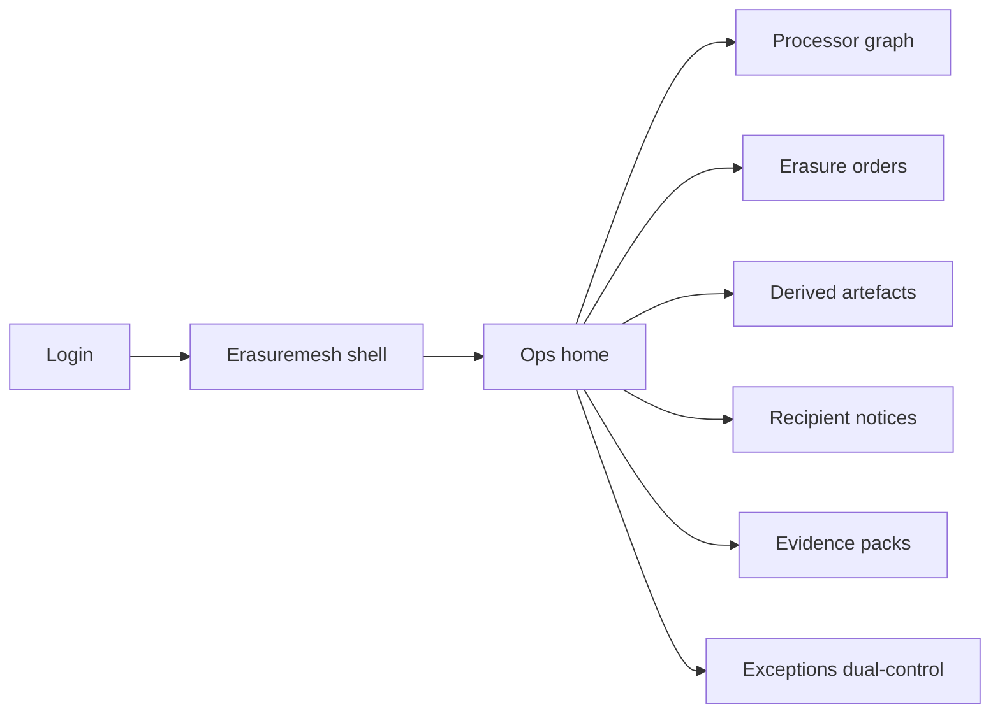
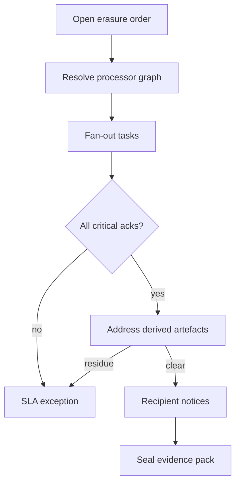

# Erasuremesh — Web app

**Product:** [PRODUCT.md](./PRODUCT.md)
**Primary surface:** Privacy-ops erasure mesh console (processor graph + order desk)
**Secondary surfaces:** Processor acknowledgement portal (narrow API-backed UI); regulator evidence pack viewer (read-only)
**Design thesis:** Erasuremesh is a supply-chain erasure control tower — the UI metaphor is a fan-out work order mesh and sealed evidence vault, not a generic DSAR inbox. Visual language is deep slate with signal-red SLA urgency and cool cyan for acknowledged purge nodes; derived artefacts that still hold Lori-Smith residue glow amber until scrubbed. The brand wordmark sits as a quiet seal on every evidence-bearing screen so DPOs know whose cascade proof they are trusting.

## UX research synthesis

### Category peers (best-in-class)

- **OneTrust DSAR / Privacy Rights:** Multi-channel intake, workflow SLAs, and regulator-ready exports. Steal: SLA countdown and channel-agnostic intake; reject stopping at controller CRM when sub-processors remain unfinished.
- **Transcend / Securiti privacy ops:** Automated downstream delete fan-out and system inventories. Steal: per-system acknowledgement states as first-class work items; reject “delete user row” completion without derived-artefact checks.
- **ServiceNow Vendor Risk / GRC graphs:** Cascading third-party obligation views. Steal: controller → processor → sub-processor graph as navigable liability map (BR-8); reject opaque contract PDFs as the only system of record.
- **Model registry purge patterns (MLflow / feature-store admin):** Artefact scrub lists for embeddings and segments. Steal: derived persona/embedding enumeration before close (BR-2, BR-12); reject MLOps sprawl as the home screen.

### Patterns to adopt / reject

- **Adopt:** Processor graph completeness gate; Lori-Smith derived-artefact blocker; tenant-scoped erasure; dual-control force-close; recipient-notice with disproportionate-effort rationale; evidence packs without raw PII.
- **Reject:** Purple “AI privacy copilot” as primary UX; marking complete on CRM-only delete; full privacy-program suite sprawl; portability as primary nav (BR-9); editable acknowledgement timestamps.

### Trust, density, and workflow constraints from PRODUCT.md

Orders cannot complete without graph resolution (BR-1). Derived artefacts must be purged or exempted (BR-2, BR-12). SLA clock is visible and extension-logged (BR-3). Recipient notices tracked (BR-4). Evidence exportable without payloads (BR-5). Multi-tenant isolation (BR-6). Overdue critical nodes block DPO view (BR-7). Roles on edges match liability narrative (BR-8). Dual control for overrides (BR-10). Retention for dispute windows (BR-11).

## Information architecture

### Nav model

### Roles → default home

| Role | Default home | Why |
|------|--------------|-----|
| DPO | Ops home — SLA + blocking exceptions | Cascade liability visibility (BR-7) |
| Privacy operations analyst | Erasure orders queue | Channel-agnostic intake and SLA |
| Vendor / processor manager | Processor graph / overdue tasks | Acknowledgement chase |
| Product engineer (derived models) | Derived artefacts | Scrub personas/embeddings (BR-2) |
| Platform administrator | Exceptions dual-control | Force-close governance (BR-10) |
| Auditor / enterprise customer | Evidence packs | Proof without raw PII (BR-5) |

### Cross-links to OpenAPI resources

| Nav area | OpenAPI tags / resources |
|----------|---------------------------|
| Processor graph | ProcessorGraph |
| Erasure orders | ErasureOrders |
| Derived artefacts | DerivedArtefacts |
| Recipient notices | RecipientNotices |
| Evidence packs | EvidencePacks |

## Screen inventory

### Ops home

- **Purpose:** Answer “which forget orders will breach SLA with incomplete processor or derived residue?” in one composition.
- **Entry:** Post-login for DPO/analyst roles.
- **Layout regions:** Brand + tenant switcher; open orders by SLA band; blocking overdue nodes; derived-unaddressed count; recent packs.
- **Primary actions:** Open hottest order; jump to overdue processor; export weekly exception report.
- **Empty / loading / error:** Empty = connect first graph edge; loading = skeleton; error = retry with request id.
- **BR / story ties:** BR-3, BR-7, BR-12; DPO stories.

### Processor graph

- **Purpose:** Maintain controller → processor → sub-processor map with contractual roles per edge.
- **Entry:** Nav → Processor graph.
- **Layout regions:** Graph canvas; node detail (systems, contacts, ack API status); edge role (controller/processor/joint); criticality flags.
- **Primary actions:** Add node/edge; mark critical; test acknowledgement endpoint.
- **Empty / loading / error:** Empty = import from CLM; broken API = coral node state.
- **BR / story ties:** BR-1, BR-8; vendor manager stories.

### Erasure order desk

- **Purpose:** Intake verbal/written forget requests; fan out tasks; enforce SLA.
- **Entry:** Nav → Orders; home CTA.
- **Layout regions:** Queue (status, SLA countdown, tenant); order detail with child tasks; extension log; completion policy checklist.
- **Primary actions:** Open order; dispatch; record extension; attempt close (blocked if graph/derived incomplete).
- **Empty / loading / error:** Empty = guided intake; close refused with Lori-Smith checklist.
- **BR / story ties:** BR-1, BR-3, BR-6, BR-12.

### Derived artefact registry

- **Purpose:** Enumerate personas, embeddings, segments; purge or document exemption.
- **Entry:** Order detail; nav → Derived.
- **Layout regions:** Artefact list tied to subject pseudonym; purge workflow status; exempt rationale; segment-refresh block banner.
- **Primary actions:** Mark purged; request eng scrub; exempt with rationale; block cohort refresh.
- **Empty / loading / error:** Unknown catalogue = amber “inventory incomplete — cannot close”.
- **BR / story ties:** BR-2, BR-12; product engineer stories.

### Recipient notices

- **Purpose:** Notify prior recipients or record disproportionate-effort justification.
- **Entry:** Order workflow step; nav.
- **Layout regions:** Recipient list; notice status; justification editor; audit trail.
- **Primary actions:** Send notice; mark disproportionate with rationale.
- **Empty / loading / error:** No prior disclosures = auto-complete with log.
- **BR / story ties:** BR-4.

### Evidence pack viewer

- **Purpose:** Assemble regulator/customer packs without raw personal data.
- **Entry:** Order complete path; auditor role.
- **Layout regions:** Pack preview (acks, purges, notices, hashes); download; seal timestamp.
- **Primary actions:** Generate; verify seal; share time-boxed link.
- **Empty / loading / error:** Incomplete prerequisites listed as blockers.
- **BR / story ties:** BR-5, BR-11.

### Exceptions dual-control

- **Purpose:** Force-close only with two authorised operators when a node fails past SLA.
- **Entry:** Blocking exception from home; admin queue.
- **Layout regions:** Pending overrides; requester/approver panes; impact on evidence narrative.
- **Primary actions:** Approve; deny; require vendor remediation plan.
- **Empty / loading / error:** Empty = no pending force-closes.
- **BR / story ties:** BR-7, BR-10.

### Processor acknowledgement portal

- **Purpose:** Narrow surface for processors to ack purge via API-backed UI.
- **Entry:** Magic link / SSO for processor contacts.
- **Layout regions:** Task list for their node; proof upload (hash); SLA remaining.
- **Primary actions:** Acknowledge; attach proof hash; request clarification.
- **Empty / loading / error:** No open tasks = healthy empty.
- **BR / story ties:** BR-1; vendor manager stories.
- **Mobile notes:** Mobile-usable for on-call vendor contacts; evidence download desktop-preferred.

## Key flows

1. **Cascade erasure** — intake → resolve graph → fan-out tasks → acks → derived purge → notices → pack → close; failure: any critical node or unaddressed derived blocks complete (BR-1, BR-2, BR-12).

2. **Lori-Smith residue catch** — CRM deleted → derived persona still live → refuse complete → eng purge → re-check (BR-12).

3. **Tenant-scoped SaaS erase** — select tenant → isolate tasks → other tenants untouched (BR-6).

4. **Force-close dual control** — overdue node → exception → second approver → pack notes incomplete node with rationale (BR-10).

5. **Regulator export** — sealed pack → hash verify → share without PII payload (BR-5).

## Design system

### Tokens (CSS variables)

- `--color-ink: #E8EEF2` — primary text
- `--color-slate-950: #0B1016` — app ground
- `--color-slate-900: #141C26` — panels
- `--color-slate-700: #2C3A4A` — rules
- `--color-cyan: #3DB8C5` — acknowledged / purged node
- `--color-cyan-dim: #1A5F66` — cyan on dark
- `--color-amber: #E0A100` — derived residue / provisional
- `--color-signal: #E24B4B` — SLA breach / blocking
- `--color-steel: #7A90A4` — secondary labels
- `--color-brand: #8EC9D0` — Erasuremesh wordmark
- `--font-display: "IBM Plex Sans", sans-serif`
- `--font-mono: "IBM Plex Mono", monospace` — order ids, proof hashes
- `--space-1`…`--space-8`: 4px scale
- `--radius-sm: 4px`; `--radius-md: 8px`
- `--motion-ack: 180ms ease-out` — node green flash
- `--motion-sla: 260ms ease-in-out` — breach pulse
- `--motion-seal: 200ms ease-out` — pack seal
- Atmosphere: faint mesh-grid background suggesting supply-chain links; no stock “padlock on cloud” heroes in console.

### Typography & brand

- Display for SLA numerals and titles; mono for order/task ids and proof hashes.
- Brand on every evidence and order-complete view.
- Login: brand hero; headline (“Forget across the whole chain”); one CTA — no fine-amount scare tiles as decoration.

### Do / don’t

- **Do:** Block complete on derived residue; show role per graph edge; tenant scope chrome; dual-control overrides.
- **Don’t:** Purple privacy glow; CRM-only done states; raw PII in packs; portability studio as primary nav.

### Accessibility & domain trust cues

- AA+ contrast; SLA and block states use text + icon.
- Live regions for SLA breach and force-close decisions.
- Focus order: graph → order → derived → notices → pack.

## Component patterns

- **ProcessorGraphCanvas** — navigable cascade with role labels.
- **SlaCountdownChip** — month/28-day operational target with extension mark.
- **DerivedResidueBanner** — Lori-Smith class blocker.
- **AckNodeRow** — pending / ack / overdue / exempt.
- **EvidencePackSeal** — hash + timestamp without payloads.
- **TenantScopeBadge** — multi-tenant isolation cue.
- **DualControlForceClose** — requester/approver split.
- **DisproportionateEffortNote** — auditable notice exception.

## Out of scope for v1 web

- Full privacy-program suite (DPIA factories, training LMS); primary portability studio (BR-9); 72-hour breach IR as core product; consumer self-serve beyond intake; agency white-label portals.
